# 🚀 GCP Batch Data Pipeline Manual
### GA4 · Inventory System · CRM → BigQuery

> **A complete step-by-step reference for setting up a real-client batch data pipeline on Google Cloud Platform.**
> Covers every batch service option, *why* you pick each one, architecture diagrams, and cost estimates.
> *(Streaming / live data pipeline — Phase 2, covered separately)*

---

<div align="center">

| 📌 Sources | 🔧 Stack | 📦 Output | 🗓️ Updated |
|:---:|:---:|:---:|:---:|
| GA4 · Inventory · CRM | BigQuery · GCS · Cloud Data Fusion · Dataflow · Dataproc · Dataform · Cloud Scheduler | Unified Analytics Layer | March 2026 |

</div>

---

## 📋 Table of Contents

- [0 — The Big Picture](#0--the-big-picture)
- [1 — GCP Project Pre-Flight](#1--gcp-project-pre-flight)
- [2 — Source 1: GA4 → BigQuery](#2--source-1-ga4--bigquery)
- [3 — Source 2: Inventory System → BigQuery](#3--source-2-inventory-system--bigquery)
- [4 — Source 3: CRM → BigQuery](#4--source-3-crm--bigquery)
- [5 — BigQuery Layer: Structure & Transformations](#5--bigquery-layer-structure--transformations)
- [6 — Batch Pipeline Schedule & Orchestration](#6--batch-pipeline-schedule--orchestration)
- [7 — Cost Estimates](#7--cost-estimates)
- [8 — Pre-Production Checklists](#8--pre-production-checklists)
- [9 — Service Comparison](#9--service-comparison)
- [10 — References](#10--references)

---

## 0 — The Big Picture

### Why BigQuery on GCP?

BigQuery is Google Cloud's **fully managed, serverless data warehouse** — no cluster management, no idle server costs. Pay only for storage and queries actually run. For a real-client batch pipeline ingesting GA4 + CRM + Inventory data, this is the production gold standard.

| Principle | What It Means |
|-----------|--------------|
| OLAP, not OLTP | BigQuery is for analytics — not your app's transactional database |
| Pay per TB scanned | Charged on data *scanned* by queries, not per query count |
| Partition + Cluster | Your biggest cost levers — always use both on every table |
| Free tier | First 1 TB queries/month + 10 GB storage = always free |
| Serverless | No servers, no idle cost, auto-scales to any query size |

---

### Master Batch Architecture — All 3 Sources

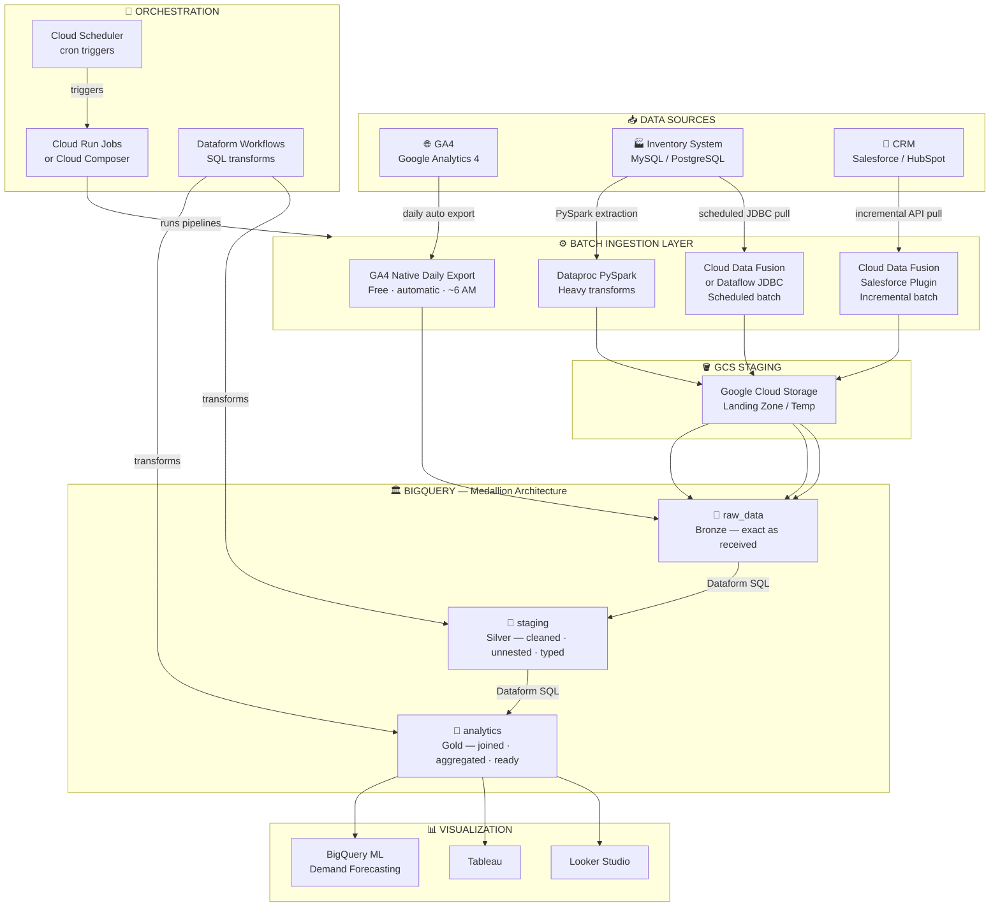

---

### 3-Layer Medallion Architecture

This is the standard batch data architecture. Always follow it.

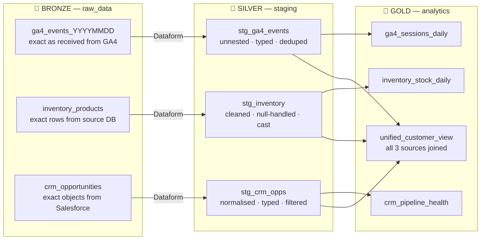

> ⚠️ **Rule:** Analysts and dashboards query **only** the `analytics/` Gold layer. Raw tables are never exposed to end consumers.

---

## 1 — GCP Project Pre-Flight

Every pipeline runs inside a GCP Project — your billing and access container. Set it up once, correctly.

### Setup Flow

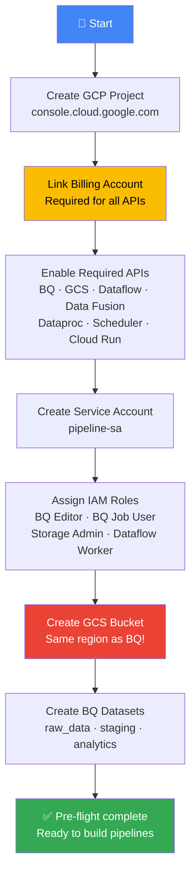

---

### Step 1 — Create / Select a GCP Project

**Where:** [console.cloud.google.com](https://console.cloud.google.com) → Top dropdown → **New Project**

```
Recommended naming:
  client-data-platform-prod
  acme-analytics-gcp
  retail-pipeline-dev
```

> Note the **Project ID** — it appears in every resource name, CLI command, and BQ query.

---

### Step 2 — Enable Billing

**Where:** GCP Console → **Billing** → Link a billing account

> ⚠️ Without billing, APIs won't activate. For internship: confirm with your manager before enabling.

---

### Step 3 — Enable Required APIs

**Where:** APIs & Services → **Enable APIs and Services**

| API | Why You Need It |
|-----|----------------|
| **BigQuery API** | Core data warehouse |
| **Cloud Storage API** | Staging bucket for data in transit |
| **Dataflow API** | Batch data processing jobs |
| **Cloud Data Fusion API** | No-code ETL (Salesforce, DB connectors) |
| **Dataproc API** | Managed Spark cluster for large-scale batch |
| **Cloud Scheduler API** | Cron-like job scheduling |
| **Cloud Run API** | Serverless containers for pipeline scripts |
| **Vertex AI API** | ML forecasting on inventory (optional) |

---

### Step 4 — Create Service Account

**Where:** IAM & Admin → Service Accounts → **Create**

```
Name: pipeline-sa
```

| Role | Why |
|------|-----|
| BigQuery Data Editor | Read/write BQ table data |
| BigQuery Job User | Run queries and load jobs |
| Storage Admin | Read/write GCS staging bucket |
| Dataflow Worker | Execute Dataflow batch jobs |
| Dataproc Worker | Run PySpark jobs on Dataproc |

> 🔐 Download JSON key → store in **Secret Manager**. Never in code or Git.

---

### Step 5 — Create GCS Staging Bucket

**Where:** Cloud Storage → **Create Bucket**

```
Name:   client-pipeline-staging-{project-id}
Region: ← SAME as your BigQuery datasets  ⚠️ CRITICAL
Class:  Standard
```

> 🚨 **Region mismatch = #1 setup error.** If BQ is in `US` and GCS is in `us-east1`, cross-region reads fail or cost extra. Pick one region on Day 1 and use it everywhere.

---

### Step 6 — Create BigQuery Datasets

**Where:** BigQuery Console → **+ Create Dataset**

| Dataset | Layer | Purpose |
|---------|-------|---------|
| `raw_data` | 🥉 Bronze | All source tables land here — never modify |
| `staging` | 🥈 Silver | Cleaned, unnested, typed tables |
| `analytics` | 🥇 Gold | Final tables for dashboards and analysts |

> Same region as GCS bucket — every time.

---

### IAM Roles Reference

| Role | What It Allows | When to Assign |
|------|---------------|----------------|
| BigQuery Data Editor | Read/write table data | Pipeline service accounts |
| BigQuery Job User | Run queries and jobs | Pipeline + analyst accounts |
| BigQuery Admin | Full BQ management | DE leads / admins only |
| Storage Admin | GCS bucket operations | Dataflow, Dataproc SAs |
| Dataflow Worker | Execute Dataflow batch jobs | Dataflow service account |
| Dataproc Worker | Run PySpark jobs | Dataproc service account |

---

## 2 — Source 1: GA4 → BigQuery

GA4 has a **native, FREE daily export to BigQuery.** No ETL tool needed. Configure once, runs automatically every morning.

> 📖 **Reference:** [unmasked2105.github.io/GA4_to_Bquery](https://unmasked2105.github.io/GA4_to_Bquery/) · [Google Official Docs](https://support.google.com/analytics/answer/9823238)

---

### GA4 Batch Setup Flow

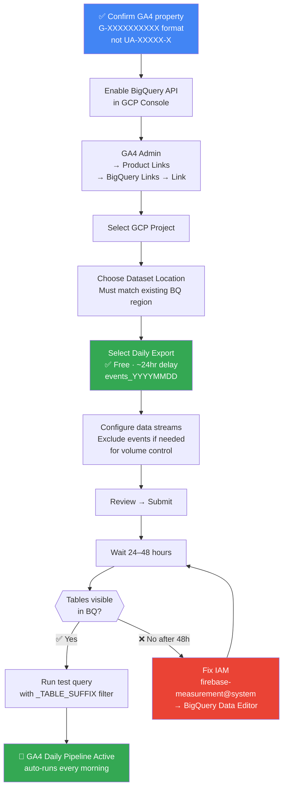

---

### Official 3-Step Setup (Google Analytics Help)

Per the [official Google Analytics support guide](https://support.google.com/analytics/answer/9823238):

#### Step 1 — Create GCP Project & Enable BigQuery

1. Log in to [console.cloud.google.com](https://console.cloud.google.com)
2. Create or select a GCP project
3. Go to **APIs & Services → Library**
4. Find **BigQuery API** → click **Enable**
5. Agree to Terms of Service if prompted

> You can export to the **BigQuery sandbox free of charge** (10 GB storage, 1 TB query/month sandbox limits). No payment method needed for sandbox. Upgrade when going to production.

#### Step 2 — Prepare Project for Export

Confirm your project has:
- BigQuery API enabled
- At least one BQ dataset created in your chosen region
- Billing linked (or sandbox active)

#### Step 3 — Link GA4 Property to BigQuery

1. In GA4: **Admin → Product Links → BigQuery Links**
2. Click **Link**
3. Click *Choose a BigQuery project* → select your project → **Confirm**
4. Select **data location** — must match your existing BQ datasets
5. Click **Next**
6. **Configure data streams and events** — select which streams to export; optionally exclude high-volume events to stay under limits
7. Select **Daily** export ← batch only
8. Click **Next → Review → Submit**

> 📢 **Standard GA4 limit:** Daily export is capped at **1 million events per day**. If your property consistently exceeds this, exports get paused. Use event exclusions to manage volume, or upgrade to GA4 360 for higher limits.

---

### How the Daily Export Works

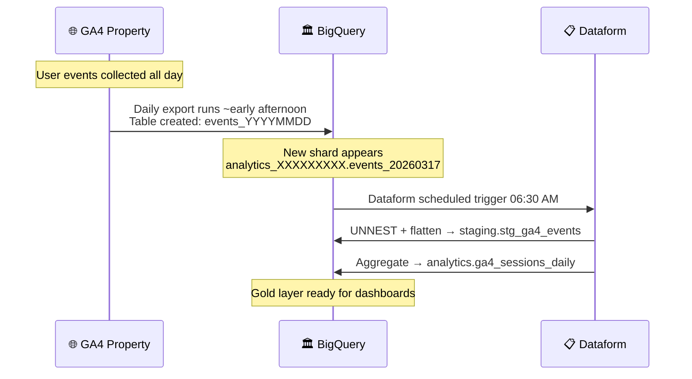

---

### IAM — Service Account Check

When you link GA4 and BigQuery, Google automatically creates:

```
firebase-measurement@system.gserviceaccount.com
```

Verify it has **BigQuery Data Editor** on your project. If data isn't appearing after 48h:

> GCP → IAM → find `firebase-measurement@system.gserviceaccount.com` → grant **BigQuery Data Editor**

---

### Export Failure Reference

| Failure | Cause | Fix |
|---------|-------|-----|
| No tables after 48h | Service account missing permissions | Grant BigQuery Data Editor to firebase-measurement SA |
| Tables created then deleted | Org policy blocking export | Review org policy in GCP Resource Manager |
| Tables stop populating | Billing settings changed | Review billing + BQ storage limits |
| Over quota | Exceeded 10 GB sandbox storage | Upgrade from sandbox or delete old data |
| 1M event limit hit | Too many events per day | Add event exclusions in BQ Link settings |

---

### GA4 Schema — What Lands in BigQuery

> ⚠️ **The most important thing:** GA4 stores ALL event parameters as `ARRAY<STRUCT>` called `event_params`. You **must use `UNNEST()`** to access any parameter value.

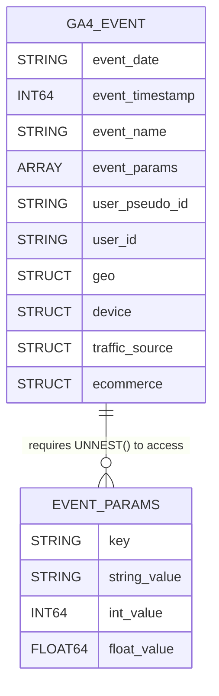

#### Full Column Reference

| Column | Type | Notes | Priority |
|--------|------|-------|----------|
| `event_date` | STRING | `YYYYMMDD` — **string, not DATE type** | 🔑 Key |
| `event_timestamp` | INT64 | Microseconds — use `TIMESTAMP_MICROS()` | 🔑 Key |
| `event_name` | STRING | page_view, session_start, purchase, scroll... | 🔑 Key |
| `event_params` | ARRAY\<STRUCT\> | **Requires UNNEST** — all params nested here | ⬡ Nested |
| `user_pseudo_id` | STRING | Anonymized cookie ID — main user identifier, not PII | 🔑 Key |
| `user_id` | STRING | Your own user ID if set via `setUserId()` — often NULL | |
| `geo.country` | STRING | From IP — no UNNEST needed | 🔑 Key |
| `geo.city` | STRING | From IP — directly accessible | |
| `device.category` | STRING | mobile / tablet / desktop | 🔑 Key |
| `device.browser` | STRING | Chrome, Safari, Firefox... | |
| `traffic_source.source` | STRING | google, direct, facebook... | 🔑 Key |
| `traffic_source.medium` | STRING | organic, cpc, email, referral... | 🔑 Key |
| `ecommerce.purchase_revenue` | FLOAT64 | Revenue — NULL for non-purchase events | 💰 |
| `ecommerce.transaction_id` | STRING | Order ID for deduplication | 💰 |

#### Most Used `event_params` Keys (all require UNNEST)

| Key | Value Field | What It Contains |
|-----|------------|-----------------|
| `page_location` | string_value | Full URL with path + query params |
| `page_title` | string_value | HTML `<title>` tag |
| `page_referrer` | string_value | Previous page URL |
| `ga_session_id` | int_value | Session ID — combine with `user_pseudo_id` for unique session |
| `ga_session_number` | int_value | Which session for this user (1st, 2nd...) |
| `engagement_time_msec` | int_value | Milliseconds user was actively engaged |
| `session_engaged` | string_value | "1" if session ≥ 10 sec or ≥ 2 pageviews |
| `percent_scrolled` | int_value | Fires at 90% scroll depth |

---

### UNNEST Template — Copy & Use

```sql
-- ✅ GA4 UNNEST pattern — flatten event_params into usable columns
-- ⚠️  ALWAYS filter _TABLE_SUFFIX — prevents scanning ALL historical shards

SELECT
    -- Direct columns (no UNNEST needed)
    event_date,
    event_name,
    user_pseudo_id,
    TIMESTAMP_MICROS(event_timestamp)        AS event_time,
    geo.country,
    geo.city,
    device.category                           AS device_type,
    traffic_source.source,
    traffic_source.medium,

    -- UNNEST — string params
    (SELECT value.string_value
     FROM UNNEST(event_params)
     WHERE key = 'page_location')            AS page_url,

    (SELECT value.string_value
     FROM UNNEST(event_params)
     WHERE key = 'page_title')               AS page_title,

    -- UNNEST — integer params
    (SELECT value.int_value
     FROM UNNEST(event_params)
     WHERE key = 'ga_session_id')            AS session_id,

    (SELECT value.int_value
     FROM UNNEST(event_params)
     WHERE key = 'engagement_time_msec')     AS engagement_ms,

    -- Ecommerce (NULL for non-purchase events)
    ecommerce.purchase_revenue,
    ecommerce.transaction_id

FROM `your_project.analytics_XXXXXXXXX.events_*`
WHERE
    -- 🚨 CRITICAL: Always filter _TABLE_SUFFIX
    -- Without this → BQ scans ALL history → surprise bill
    _TABLE_SUFFIX BETWEEN '20260101' AND '20260131'
;
```

> 🚨 **NEVER query `events_*` without a `_TABLE_SUFFIX` filter.**
> Each day = one table shard. Without the filter BQ scans ALL history = surprise bill.
> This is the #1 most common GA4 BQ cost mistake.

---

### GA4 Volume & Cost Estimates (Batch / Daily)

| Client Scale | Daily Events | Monthly Table Size | Est. Query Cost/Month |
|-------------|-------------|--------------------|-----------------------|
| Small (< 10K users/day) | ~200K | ~500 MB | < $1 |
| Medium (10K–100K/day) | ~2M | ~5 GB | $1–10 |
| Large (100K+/day) | ~20M | ~50 GB | $10–50 |
| Enterprise (1M+/day) | ~200M | ~500 GB | $50–500 |

---

## 3 — Source 2: Inventory System → BigQuery

Inventory systems are typically relational databases (MySQL, PostgreSQL, SQL Server, Oracle). For batch pipelines, you have three solid options depending on team skills and scale.

---

### Batch Option Selection

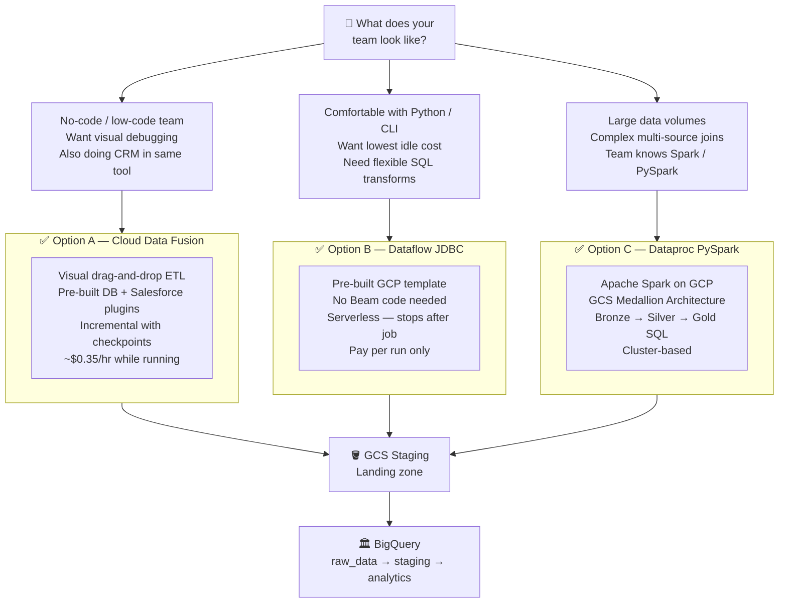

---

### Option A — Cloud Data Fusion (No-Code Batch) ✅

**Why pick this:** No-code/low-code team, using same tool for CRM pipeline, want visual debugging, managed incremental loading.

#### Pipeline Architecture

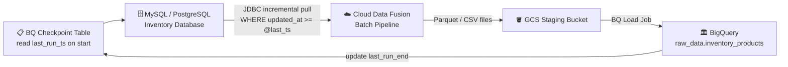

#### Step 1 — Create a Cloud Data Fusion Instance

**Where:** GCP Console → **Cloud Data Fusion** → **Create Instance**

| Tier | Cost | Use For |
|------|------|---------|
| Developer | ~$0 (auto-stops) | Dev / test only |
| Basic | ~$0.35/hr (~$250/month if left running) | Small production |
| Enterprise | Higher | HA, large scale |

> ⚠️ **Cost trap:** A Basic instance charges ~$250/month even when idle. **Stop the instance between runs.**

#### Step 2 — Create JDBC Connection

Studio → **Connections** → **Add Connection** → MySQL / PostgreSQL

- Enter: host, port, database name, username
- Store password in **Secret Manager** for production
- Click **Test Connection** — must show "Successfully connected"

#### Step 3 — Build the Batch Pipeline in Studio

1. Studio → **Create Pipeline** → **Batch**
2. Drag **Database Source** → **Wrangler** (optional) → **BigQuery Sink**
3. Source query: `SELECT * FROM products WHERE updated_at >= @last_run_ts`
4. Sink: dataset `raw_data`, table `inventory_products`, mode: **UPSERT**

#### Step 4 — Checkpoint Table

```sql
-- Track last successful run for incremental loading
CREATE TABLE staging.pipeline_checkpoints (
    pipeline_name   STRING,
    last_run_start  TIMESTAMP,
    last_run_end    TIMESTAMP,
    rows_processed  INT64
);

-- '1900-01-01' makes the first run load ALL historical records
INSERT INTO staging.pipeline_checkpoints VALUES
('inventory_products', TIMESTAMP('1900-01-01'), TIMESTAMP('1900-01-01'), 0);
```

Pipeline reads `last_run_end` on start → uses as `WHERE updated_at >= @last_run_ts` → updates record on successful finish.

#### Step 5 — Schedule

Pipeline → **Schedule** → cron: `0 2 * * *` (2 AM daily)

---

### Option B — Dataflow JDBC (Code-Based Batch)

**Why pick this:** Team is comfortable with CLI/code, want pay-per-run model with zero idle cost, flexible SQL.

```bash
# Use Google's pre-built JDBC → BigQuery Dataflow template
# No Apache Beam code required — just fill in parameters

gcloud dataflow jobs run inventory-to-bq-$(date +%Y%m%d) \
  --gcs-location gs://dataflow-templates/latest/Jdbc_to_BigQuery \
  --region us-central1 \
  --parameters \
    driverClassName=com.mysql.jdbc.Driver,\
    connectionURL="jdbc:mysql://10.0.0.5:3306/inventory",\
    query="SELECT * FROM products WHERE updated_at >= '2026-03-01'",\
    outputTable=your_project:raw_data.inventory_products,\
    bigQueryLoadingTemporaryDirectory=gs://staging-bucket/temp/
```

> Dataflow **stops after the job completes** — you only pay while the job runs. Much cheaper than a running Data Fusion instance for simple daily batch jobs.

---

### Option C — Dataproc PySpark (Large-Scale Batch)

Based on the [GCP Retail Analytics Pipeline](https://github.com/ritoban23/gcp-retail-analytics-pipeline) using **Dataproc + PySpark → GCS → BigQuery Medallion Architecture**.

**Why pick this:** Very large data volumes, complex multi-table joins during ingestion, team knows Spark.

#### Full Pipeline Flow

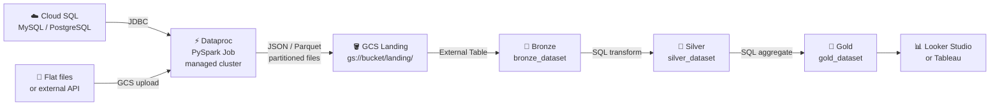

#### Submit PySpark Jobs

```bash
# Submit inventory ingestion job to Dataproc
gcloud dataproc jobs submit pyspark ingestion/ingest_inventory.py \
  --cluster=my-cluster --region=us-central1

# Create the three BQ datasets
bq mk bronze_dataset
bq mk silver_dataset
bq mk gold_dataset
```

#### Bronze → Silver → Gold SQL

```sql
-- 🥉 BRONZE: raw external table pointing at GCS files
CREATE OR REPLACE EXTERNAL TABLE bronze_dataset.products
OPTIONS (
  format = 'NEWLINE_DELIMITED_JSON',
  uris = ['gs://YOUR_GCS_BUCKET/landing/inventory/products/*.json']
);

-- 🥈 SILVER: cleaned native BQ table
CREATE OR REPLACE TABLE silver_dataset.products AS
SELECT
  product_id,
  product_name,
  CAST(price AS FLOAT64)    AS price,
  category_id,
  CAST(stock_qty AS INT64)  AS stock_qty,
  updated_at
FROM bronze_dataset.products
WHERE product_id IS NOT NULL
  AND product_name IS NOT NULL;

-- 🥇 GOLD: business-ready aggregate
CREATE OR REPLACE TABLE gold_dataset.inventory_summary AS
SELECT
  category_id,
  COUNT(product_id)   AS total_skus,
  SUM(stock_qty)      AS total_stock,
  AVG(price)          AS avg_price,
  MIN(price)          AS min_price,
  MAX(price)          AS max_price
FROM silver_dataset.products
GROUP BY category_id
ORDER BY total_stock DESC;
```

---

### Bonus — BigQuery ML for Demand Forecasting

Based on the [GCP Inventory Management ML project](https://github.com/trungle14/GoogleCloud_InventoryManagement). Once inventory data is in BQ, use **BigQuery ML** for sales forecasting entirely in SQL — no separate ML platform.

```sql
-- Train ARIMA+ time series model (runs as a batch SQL job)
CREATE OR REPLACE MODEL analytics.inventory_demand_forecast
OPTIONS(
  model_type                = 'ARIMA_PLUS',
  time_series_timestamp_col = 'order_date',
  time_series_data_col      = 'total_qty_sold',
  time_series_id_col        = 'product_id',
  holiday_region            = 'IN',   -- change to client's country code
  auto_arima                = TRUE
) AS
SELECT
  DATE(order_date)   AS order_date,
  product_id,
  SUM(quantity)      AS total_qty_sold
FROM analytics.inventory_stock_daily
GROUP BY 1, 2;

-- Generate 30-day forward forecast
SELECT *
FROM ML.FORECAST(
  MODEL analytics.inventory_demand_forecast,
  STRUCT(30 AS horizon, 0.9 AS confidence_level)
);
```

> Enables reorder point predictions and "out of stock in X days" alerts — all in SQL, no separate ML infrastructure.

---

### Inventory Volume & Cost Estimates (Batch)

| Scale | Daily Rows Processed | Dataflow Cost/Run | Data Fusion Cost/Run |
|-------|---------------------|------------------|---------------------|
| Small (< 10K SKUs) | ~5K rows | < $0.50 | ~$0.70 (2hr instance) |
| Medium (10K–100K SKUs) | ~50K rows | ~$1–3 | ~$1.40 (4hr instance) |
| Large (500K+ SKUs) | ~500K rows | ~$5–15 | ~$3.50 (10hr instance) |

---

## 4 — Source 3: CRM → BigQuery

CRM platforms (Salesforce, HubSpot, Zoho, custom) are the most complex source due to object models and API rate limits. All options below are batch / scheduled incremental.

---

### CRM Tool Selection

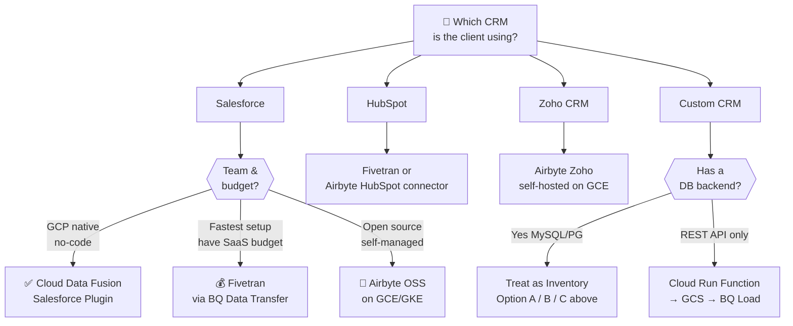

---

### Option A — Salesforce via Cloud Data Fusion ✅

**Why pick this:** GCP native, no-code, same tool as inventory pipeline, supports incremental sync with checkpoint, visual debugging.

#### Incremental Pipeline Flow

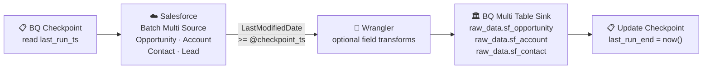

#### Step 1 — Get Salesforce Connected App Credentials

In Salesforce: **Setup → App Manager → New Connected App**

- Enable **OAuth Settings**
- Callback URL: `https://login.salesforce.com/services/oauth2/callback`
- OAuth Scopes: `api`, `refresh_token`
- Note: **Consumer Key**, **Consumer Secret**, **Username**, **Password + Security Token**

#### Step 2 — Create Salesforce Connection in Data Fusion

Studio → **Connections** → **Add Connection** → **Salesforce**

- Username, Password + Security Token (concatenated as one string)
- Consumer Key, Consumer Secret
- Click **Test Connection** — must show "Successfully connected"

#### Step 3 — Build the Incremental Pipeline

1. Studio → **Create Pipeline** → **Batch**
2. Drag **Salesforce Batch Multi Source** → **Wrangler** → **BigQuery Multi Table Sink**
3. In Salesforce source: select objects — Opportunity, Account, Contact, Lead
4. Set incremental filter: `LastModifiedDate >= @checkpoint_ts`
5. Sink dataset: `raw_data`, mode: UPSERT

#### Step 4 — Checkpoint Table

```sql
CREATE TABLE staging.salesforce_checkpoint (
    object_name     STRING,
    last_completion TIMESTAMP,
    rows_synced     INT64
);

-- '1900-01-01' loads ALL historical records on the first run
INSERT INTO staging.salesforce_checkpoint VALUES
('Lead',        TIMESTAMP('1900-01-01T00:00:00Z'), 0),
('Contact',     TIMESTAMP('1900-01-01T00:00:00Z'), 0),
('Account',     TIMESTAMP('1900-01-01T00:00:00Z'), 0),
('Opportunity', TIMESTAMP('1900-01-01T00:00:00Z'), 0);
```

#### Step 5 — Schedule

Pipeline → **Schedule** → cron: `0 3 * * *` (3 AM daily, after inventory pipeline)

---

### Option B — Salesforce via Fivetran (Fastest to Production)

**Why pick this:** Need production-ready in < 1 day, no pipeline maintenance bandwidth, client has SaaS budget.

**Where:** BQ Console → **Data Transfers** → **Create Transfer** → **Salesforce by Fivetran**

Fivetran uses Salesforce Bulk API for large syncs, REST API for incremental. Auto-detects schema changes and auto-updates BQ tables. Historical data loaded on first sync.

**Cost:** ~$500 per million monthly active rows (MAR) on Standard plan.

---

### Option C — Other CRMs

| CRM | Recommended Batch Approach |
|-----|--------------------------|
| HubSpot | Fivetran or Airbyte HubSpot connector (scheduled daily) |
| Zoho CRM | Airbyte Zoho connector — self-host on GCE, schedule with Cloud Scheduler |
| Custom CRM (REST API) | Cloud Run Function → pulls API → writes to GCS → `bq load` → Cloud Scheduler |
| Custom CRM (DB backend) | Treat as Inventory System — use Option A, B, or C above |

---

### Key CRM Objects to Sync

| Object | Priority | Used For |
|--------|----------|----------|
| Opportunity | 🔑 High | Pipeline, win rates, deal velocity, revenue forecast |
| Account | 🔑 High | Customer segmentation, industry, geography |
| Contact / Lead | 🔑 High | Funnel analysis, conversion rates, source attribution |
| Campaign | Medium | Marketing attribution, campaign ROI |
| User / User Role | Medium | Sales rep performance, territory |
| Activity / Task | Low–Medium | Touchpoint analysis, rep activity tracking |

---

## 5 — BigQuery Layer: Structure & Transformations

### Partitioning & Clustering — Biggest Cost Controls

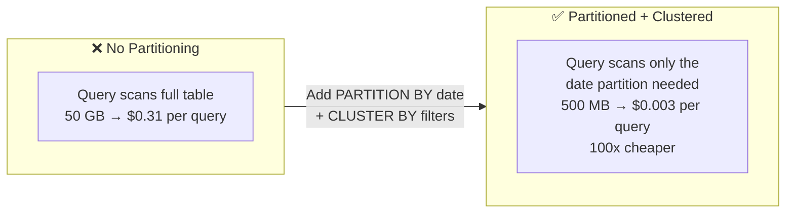

```sql
-- ✅ Create partitioned + clustered table
CREATE TABLE analytics.ga4_events_flat
PARTITION BY event_date
CLUSTER BY event_name, geo_country
AS
SELECT
    PARSE_DATE('%Y%m%d', event_date) AS event_date,
    event_name,
    geo.country                       AS geo_country,
    user_pseudo_id,
    device.category                   AS device_type,
    traffic_source.source,
    traffic_source.medium,
    (SELECT value.string_value FROM UNNEST(event_params) WHERE key = 'page_location') AS page_url,
    (SELECT value.int_value   FROM UNNEST(event_params) WHERE key = 'ga_session_id')  AS session_id
FROM `your_project.raw_data.analytics_XXXXXXXXX.events_*`
WHERE _TABLE_SUFFIX = '20260101';
```

**Clustering rules:**
- Cluster by columns you frequently use in `WHERE` or `GROUP BY`
- Best candidates: `event_name`, `geo_country`, `device_type`, `product_id`
- Up to 4 clustering columns per table
- **Clustering is free** — always add it

---

### Materialized Views

For dashboards running the same expensive aggregations on every refresh:

```sql
CREATE MATERIALIZED VIEW analytics.mv_daily_sessions AS
SELECT
    event_date,
    geo_country,
    device_type,
    COUNT(DISTINCT session_id)      AS sessions,
    COUNT(DISTINCT user_pseudo_id)  AS unique_users,
    SUM(engagement_ms) / 1000       AS total_engagement_sec
FROM analytics.ga4_events_flat
GROUP BY 1, 2, 3;
-- BQ automatically refreshes and routes dashboard queries to cached result
-- Dashboard query cost drops 80–95%
```

---

### Dataform — SQL Transformation Layer

Dataform is GCP's native SQL transformation tool. Manages dependencies, incremental loads, scheduling, and data lineage — no extra infrastructure.

**Where:** BQ Console → **Dataform** → **Create Repository**

```javascript
// definitions/staging/stg_ga4_events.sqlx
config {
  type: "incremental",
  schema: "staging",
  uniqueKey: ["event_date", "event_timestamp", "user_pseudo_id"],
  partitionBy: "event_date",
  clusterBy: ["event_name", "geo_country"]
}

SELECT
    PARSE_DATE('%Y%m%d', event_date)  AS event_date,
    event_name,
    user_pseudo_id,
    geo.country                        AS geo_country,
    device.category                    AS device_type,
    traffic_source.source,
    traffic_source.medium,
    (SELECT value.string_value FROM UNNEST(event_params) WHERE key = 'page_location') AS page_url,
    (SELECT value.int_value   FROM UNNEST(event_params) WHERE key = 'ga_session_id')  AS session_id
FROM ${ref("analytics_XXXXXXXXX", "events_*")}
WHERE _TABLE_SUFFIX = FORMAT_DATE('%Y%m%d', DATE_SUB(CURRENT_DATE(), INTERVAL 1 DAY))
${when(incremental(), `AND event_date > (SELECT MAX(event_date) FROM ${self()})`)}
```

**Schedule:** Dataform → **Workflows** → Create → trigger at 06:30 AM daily (after GA4 export lands)

---

## 6 — Batch Pipeline Schedule & Orchestration

### Daily Schedule — All 3 Sources

```mermaid
gantt
    title Daily Batch Pipeline Schedule
    dateFormat HH:mm
    axisFormat %H:%M

    section Inventory
    Data Fusion or Dataflow job       :02:00, 2h
    Dataform silver transform         :05:00, 30m

    section CRM Salesforce
    Data Fusion incremental pull      :03:00, 1h
    Dataform silver transform         :05:30, 30m

    section GA4
    GA4 export lands (Google managed) :06:00, 30m
    Dataform UNNEST and flatten       :06:30, 45m

    section Gold Layer
    Cross-source joins and analytics  :07:00, 30m
    Dashboard refresh                 :07:30, 15m
```

---

### Full Orchestration Flow

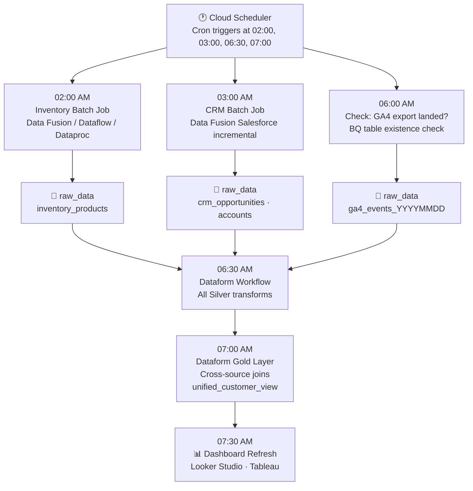

---

### Orchestration Options

#### Option A — Cloud Scheduler + Cloud Run ✅ Recommended for most

**Cost:** ~$5–20/month. Zero idle cost.

```
1. Write pipeline script (Python: calls Dataflow/Data Fusion APIs, triggers Dataform)
2. Package in Docker → push to Artifact Registry
3. Deploy as Cloud Run Job (runs to completion, stops, zero idle cost)
4. Cloud Scheduler triggers Cloud Run Job at the scheduled time
```

#### Option B — Cloud Composer (Managed Airflow)

**Use when:** Complex dependency chains (e.g., must wait for GA4 before transforming), retry logic, team knows Airflow.

```python
# DAG: wait for GA4 export → run Dataform transforms
from airflow import DAG
from airflow.providers.google.cloud.operators.bigquery import BigQueryCheckOperator
from airflow.providers.google.cloud.operators.dataform import DataformCreateWorkflowInvocationOperator

with DAG('daily_batch_pipeline', schedule_interval='0 7 * * *') as dag:

    check_ga4_landed = BigQueryCheckOperator(
        task_id='check_ga4_landed',
        sql="""
            SELECT COUNT(*) > 0
            FROM `your_project.analytics_XXXXXXXXX.events_{{ ds_nodash }}`
        """,
        use_legacy_sql=False
    )

    run_dataform = DataformCreateWorkflowInvocationOperator(
        task_id='run_dataform_transformations',
        project_id='your_project',
        region='us-central1',
        repository_id='your_dataform_repo'
    )

    check_ga4_landed >> run_dataform
```

> ⚠️ Cloud Composer costs ~$100–300+/month even idle. Use only when you genuinely need Airflow-level dependency management.

#### Option C — Dataform Workflows (SQL-Only)

If all pipeline logic is SQL transforms inside BQ: Dataform → **Workflows** → Create → add `.sqlx` definitions → set schedule → done. Handles dependency order automatically.

---

### Error Handling & Alerting

```
□ Cloud Monitoring alert on Dataflow job failure
□ Cloud Monitoring alert on Data Fusion pipeline failure
□ Cloud Monitoring alert on Dataproc job failure
□ Dataform: email alert on workflow failure
□ Cloud Billing: budget alert at 80% and 100% of monthly estimate
□ Cloud Scheduler: alert on missed job execution
□ BigQuery: set maximumBytesBilled on all queries to catch runaway scans
```

---

## 7 — Cost Estimates

### BigQuery Pricing (2025–2026)

| Component | Rate | Notes |
|-----------|------|-------|
| Storage — Active | $0.02/GB/month | Modified in last 90 days |
| Storage — Long-term | $0.01/GB/month | Unchanged 90+ days — auto-applied, 50% discount |
| Query (On-Demand) | **$6.25/TB scanned** | First 1 TB/month free |
| Batch Load from GCS | **Free** | Loading data from GCS to BQ has no charge |
| BQ Editions (Standard) | $0.04/slot-hour | Alternative for high-volume predictable workloads |
| Free Tier | 10 GB storage + 1 TB queries | Always free per billing account |

> Source: [cloud.google.com/bigquery/pricing](https://cloud.google.com/bigquery/pricing)

---

### Batch Pipeline Service Costs

| Service | Approx. Cost | Notes |
|---------|-------------|-------|
| Cloud Data Fusion Basic | ~$0.35/hr | ~$250/month if left running — **stop when not in use** |
| Cloud Data Fusion Developer | ~$0 (stopped) | Auto-stops — use for dev/test |
| Dataflow (per batch job) | ~$0.056/vCPU-hr | Stops after job — pay per run only |
| Dataproc cluster | ~$0.01/vCPU-hr | Stop cluster after jobs complete |
| Cloud Scheduler | $0.10/job/month | After first 3 free jobs per project |
| Cloud Storage | $0.02/GB/month | Staging area — usually < $5/month |
| Fivetran Standard | ~$500/million MAR | Managed SaaS |
| Airbyte OSS (self-hosted) | GCE cost only | ~$30–80/month small VM |
| Cloud Composer (smallest) | ~$100–300+/month | Only if Airflow features genuinely needed |
| BigQuery ML (training) | ~$0.25/slot-hr | Batch model training in BQ |

---

### Monthly Cost Scenarios — Batch Only

| Scenario | BQ Storage | BQ Queries | Pipeline Services | **TOTAL** |
|----------|-----------|-----------|-------------------|-----------|
| Small, < 10K users/day | < $5 | < $5 | < $20 | **~$20–30/mo** |
| Medium, 10K–100K/day | $5–20 | $10–50 | $30–80 | **~$50–150/mo** |
| Medium + Dataproc PySpark | $20–50 | $20–80 | $50–120 | **~$100–250/mo** |
| Large, 100K+ users/day | $50–200 | $100–500 | $100–300 | **~$250–1000/mo** |
| Enterprise + Fivetran | $100+ | $200+ | $500–2000 | **~$800–2500+/mo** |

> ⚠️ Always verify using the [GCP Pricing Calculator](https://cloud.google.com/products/calculator) with actual client data volumes.

---

### Cost Optimization Checklist

```
□ Always filter _TABLE_SUFFIX in GA4 queries — never scan all shards
□ PARTITION BY date on ALL tables
□ CLUSTER BY top 2–4 filter columns (event_name, country, product_id)
□ Materialized Views for repeated dashboard aggregations
□ Never SELECT * — specify only the columns you need
□ Stop Cloud Data Fusion instance after pipeline finishes
□ Long-term storage auto-activates after 90 days inactive (50% discount)
□ Set maximumBytesBilled on all query jobs
□ Use Dataform incremental mode — only process new date partitions
□ Review INFORMATION_SCHEMA.JOBS monthly for expensive queries
□ Use BigQuery ML over Vertex AI when possible (no data movement)
□ Stop Dataproc clusters immediately after jobs complete
```

---

## 8 — Pre-Production Checklists

### ✅ GCP Project Setup
```
□ GCP project created with meaningful name
□ Billing account linked (or sandbox active for dev)
□ APIs enabled: BigQuery, Storage, Dataflow, Data Fusion, Dataproc, Scheduler, Cloud Run
□ Service account created: pipeline-sa with correct IAM roles
□ Service account key stored in Secret Manager (NOT in code or Git)
□ GCS staging bucket created — same region as BQ
□ BQ datasets created: raw_data · staging · analytics (same region as GCS)
```

### ✅ GA4 Batch Pipeline
```
□ GA4 property confirmed as G-XXXXXXXXXX (not UA-XXXXX-X)
□ BigQuery API enabled in GCP project
□ GA4 → BQ link configured: Admin → Product Links → BigQuery Links
□ Dataset location matches existing BQ region
□ Daily export selected (not streaming)
□ Data stream + event exclusions configured if needed for volume
□ Service account firebase-measurement@system has BigQuery Data Editor
□ analytics_XXXXXXX dataset visible in BQ after 24–48h
□ Test query with _TABLE_SUFFIX filter returns rows
□ UNNEST SQL template tested and working
□ Dataform incremental model created, tested, and scheduled at 06:30 AM
```

### ✅ Inventory Batch Pipeline
```
□ Source DB type identified (MySQL / PostgreSQL / SQL Server / Oracle)
□ Batch tool selected: Data Fusion or Dataflow JDBC or Dataproc PySpark
□ For Data Fusion: instance created, JDBC connection tested
□ For Dataflow: template configured, test job run successfully
□ For Dataproc: cluster created, PySpark script tested end-to-end
□ Source DB user created with SELECT-only permissions
□ BQ target tables have correct schema + PARTITION BY + CLUSTER BY
□ Checkpoint table initialized in staging.pipeline_checkpoints
□ Incremental load tested: only new/changed rows processed
□ Pipeline scheduled at 02:00 AM daily
□ BigQuery ML forecast model created and tested (if required)
```

### ✅ CRM Batch Pipeline
```
□ CRM platform identified (Salesforce / HubSpot / Zoho / Custom)
□ API credentials created: Connected App or OAuth token
□ Batch tool selected: Data Fusion / Fivetran / Airbyte
□ Key objects identified: Opportunity, Account, Contact, Lead
□ Incremental sync configured with LastModifiedDate filter
□ Checkpoint table initialized in staging.salesforce_checkpoint
□ First full historical load tested and row counts verified
□ Pipeline scheduled at 03:00 AM daily
```

### ✅ BigQuery & Transformations
```
□ All tables PARTITION BY date
□ All tables CLUSTER BY top 2–4 filter columns
□ No SELECT * — all queries use explicit column lists
□ _TABLE_SUFFIX filter on ALL GA4 queries
□ Materialized views created for dashboard-critical aggregations
□ Dataform: all definitions tested, workflow scheduled
□ Gold layer cross-source joins validated against expected row counts
□ maximumBytesBilled set on all production query jobs
□ Cloud Billing budget alerts configured (80% + 100%)
□ INFORMATION_SCHEMA.JOBS review added to monthly maintenance
```

---

## 9 — Service Comparison (Batch Only)

| Service | Use Case | Pros | Cons |
|---------|----------|------|------|
| GA4 Native Daily Export | GA4 → BQ | Free, zero maintenance, one-time setup | 24hr delay, 1M event/day limit |
| Cloud Data Fusion | DB / Salesforce → BQ batch | No-code, pre-built connectors, managed incremental | ~$250/month if instance left running |
| Dataflow JDBC | DB → BQ batch | Serverless, pay-per-run, zero idle cost | Requires CLI/code knowledge |
| Dataproc PySpark | Large-scale DB → BQ | Spark power, handles complex transforms | Cluster management, more infra |
| Fivetran | Any SaaS → BQ | Fastest setup, 300+ connectors, auto-schema | Expensive SaaS, vendor lock-in |
| Airbyte (OSS) | Any source → BQ | Free, 400+ connectors, self-hosted | Self-managed infra, ops overhead |
| Dataform | BQ → BQ transforms | GCP native, SQL-based, incremental, scheduled | SQL only, no cross-source ETL |
| BigQuery ML | Forecasting in BQ | No data movement, SQL interface, batch | Limited vs. dedicated ML platforms |
| Cloud Scheduler + Run | Simple orchestration | ~$5/month, serverless, zero idle | Less visibility than Airflow |
| Cloud Composer | Complex orchestration | Full Airflow, dependency graphs | $100–300+/month idle cost |
| Looker Studio | Visualization | Free, native BQ integration | Limited for complex analytics |
| Tableau | Visualization | Powerful, flexible, enterprise | License cost |

---

## 10 — References

| Resource | Description | Link |
|----------|------------|------|
| 📖 GA4 Setup Steps (reference site) | GA4 → BQ config, schema, UNNEST patterns | https://unmasked2105.github.io/GA4_to_Bquery/ |
| 📖 Google Official: GA4 BQ Export | Official 3-step setup, permissions, failure table | https://support.google.com/analytics/answer/9823238 |
| 🔗 End-to-End GCP Analytics Pipeline | Dataflow · BQ · Tableau · Composer architecture | https://github.com/salman-shaikh7/End-to-End-Real-Time-Analytics-Pipeline-on-GCP |
| 🔗 GCP Inventory Management + ML | BigQuery ML ARIMA · Vertex AI · Looker Studio | https://github.com/trungle14/GoogleCloud_InventoryManagement |
| 🔗 GCP Retail Analytics Pipeline | Cloud SQL → Dataproc → GCS → BQ Medallion → Looker | https://github.com/ritoban23/gcp-retail-analytics-pipeline |
| 💰 BigQuery Pricing | Official pricing: storage, queries, slots | https://cloud.google.com/bigquery/pricing |
| 🛠️ Cloud Data Fusion Salesforce Tutorial | Batch incremental Salesforce → BQ with checkpoint | https://docs.cloud.google.com/data-fusion/docs/tutorials/connect-salesforce-to-bq |
| 🛠️ Cloud Data Fusion Salesforce Blog | Google Cloud blog: architecture walkthrough | https://cloud.google.com/blog/products/data-analytics/load-salesforce-data-to-bigquery-with-cloud-data-fusion |
| 🛠️ Salesforce via Fivetran (Google) | Fivetran BQ Data Transfer Service integration | https://cloud.google.com/blog/products/data-analytics/automating-data-pipelines-with-bigquery-and-fivetran |
| 💰 GCP Pricing Calculator | Build accurate cost estimates | https://cloud.google.com/products/calculator |

---

<div align="center">

### Batch Pipeline End-to-End Summary

```
GA4  ──────────────────► [Native Daily Export ~6AM]  ──────────────► raw_data.analytics_*
                                                                              │
MySQL/PG Inventory ────► [Data Fusion / Dataflow  02AM] ──► GCS ─────► raw_data.inventory
                                                                              │
Salesforce CRM ────────► [Data Fusion incremental  03AM] ─► GCS ─────► raw_data.crm_*
                                                                              │
                                                         [Dataform  06:30AM]
                                                                              │
                                         staging.stg_ga4_events  ◄───────────┤
                                         staging.stg_inventory    ◄───────────┤
                                         staging.stg_crm_opps     ◄───────────┤
                                                                              │
                                                         [Dataform  07:00AM]
                                                                              │
                                         analytics.unified_customer_view  ◄───┘
                                                                              │
                                                  [Dashboard refresh  07:30AM]
                                                  Looker Studio / Tableau  ◄──┘
```

---

**⚡ Phase 2 — Streaming / Live Data pipeline: covered in a separate document**

*Compiled from Google Cloud documentation, Google Analytics Help, and open-source reference implementations (March 2026)*
*Verify all costs at [cloud.google.com/products/calculator](https://cloud.google.com/products/calculator) before client commitments*

</div>
